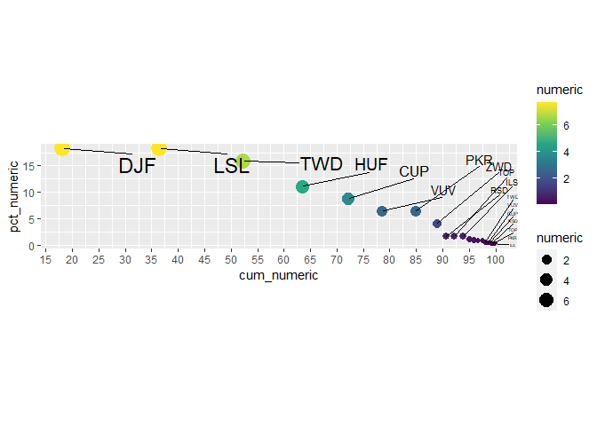

<!-- README.md is generated from README.Rmd. Please edit that file -->

# cdcper

<!-- badges: start -->
<!-- badges: end -->

El objetivo de `cdcper` es agilizar la creación de variables, gráficos e
importación bases de datos de relevancia para el Centro Nacional de
Epidemiología, Prevención y Control de Enfermedades [(CDC
Perú)](https://www.dge.gob.pe/portalnuevo/).

## Installation

<!-- You can install the released version of cdcper from [CRAN](https://CRAN.R-project.org) with: install.packages("cdcper") -->

``` r
if(!require("remotes")) install.packages("remotes")
remotes::install_github("avallecam/cdcper")
```

## Main functionalities

### General usefull functions

-   `cdc_edades_peru`: crea categorias de edades comunmente usadas.
-   `read_reunis_total`: brinda la poblacion del año en curso con la
    base de datos de REUNIS.
-   `read_reunis_edad`: brinda la población estratificada por sexo y
    etapas de vida con la base de datos de REUNIS.
-   `read_inei_poblacion`: lee archivos de población del INEI.

### Prioritization functions for Data Mining

-   `cdc_pareto_lista`: calcula porcentaje de aporte individual y aporte
    acumulado de elementos en una lista a priorizar.
-   `cdc_carga_coalesce`: permite unir (logical connector OR) los listas
    priorizadas y generar una lista concenso.

### Visualization functions

-   `cdc_dotwhiskers_plot`: genera un grafico punto-bigotes con la
    estimación puntual del promedio e intervalo de confianza de una
    variable continua por niveles de una variable categórica.

### Data sets availability

-   `denominadores_departamento_2000_2020_peru` department level
    population estimates 2000-2020
-   `edad_estandarizada_who` estandardize factors to estandardize raw
    rates by age

## Example

This is a basic example which shows you how to solve a common problem:

``` r
library(cdcper)
#> Registered S3 method overwritten by 'quantmod':
#>   method            from
#>   as.zoo.data.frame zoo
#> Registered S3 method overwritten by 'cli':
#>   method     from         
#>   print.boxx spatstat.geom
## basic example code
```

``` r
example(cdc_dotwhiskers_plot)
#> 
#> cdc_d_> # inspiration: https://twitter.com/robinson_es/status/1193204992120958976/photo/1
#> cdc_d_> 
#> cdc_d_> library(tidyverse)
#> 
#> cdc_d_> library(charlatan)
#> 
#> cdc_d_> n_obs <- 33
#> 
#> cdc_d_> set.seed(n_obs)
#> 
#> cdc_d_> ch_data_wide <- tibble(
#> cdc_d_+   #values
#> cdc_d_+   values_01 = ch_integer(n = n_obs,min = 5,max = 10),
#> cdc_d_+   values_02 = ch_integer(n = n_obs,min = 5,max = 20),
#> cdc_d_+   values_03 = ch_integer(n = n_obs,min = 5,max = 30),
#> cdc_d_+   category = ch_integer(n = n_obs,min = 0,max = 1) %>% as.logical()) %>%
#> cdc_d_+   pivot_longer(cols = values_01:values_03,
#> cdc_d_+                names_to = "variable",
#> cdc_d_+                values_to = "value")
#> 
#> cdc_d_> # ch_data_wide %>%
#> cdc_d_> #   group_by(variable) %>%
#> cdc_d_> #   skimr::skim_without_charts()
#> cdc_d_> 
#> cdc_d_> cdcper::cdc_dotwhiskers_plot(data = ch_data_wide,
#> cdc_d_+                              var_categorical = variable,
#> cdc_d_+                              var_continuous = value) %>%
#> cdc_d_+   ggplot(aes(x = estimate,y = variable)) +
#> cdc_d_+   geom_errorbarh(aes(xmax = conf.high, xmin = conf.low)) +
#> cdc_d_+   geom_point()
```


    #> 
    #> cdc_d_> cdcper::cdc_dotwhiskers_plot_2(data = ch_data_wide,
    #> cdc_d_+                                var_continuous = value,
    #> cdc_d_+                                category, variable)
    #> # A tibble: 6 x 12
    #> # Groups:   category [2]
    #>   category variable  total_n t_test  estimate statistic  p.value parameter
    #>   <lgl>    <chr>       <int> <list>     <dbl>     <dbl>    <dbl>     <dbl>
    #> 1 FALSE    values_01      18 <htest>     7.33     15.6  1.73e-11        17
    #> 2 FALSE    values_02      18 <htest>    10.2      11.2  3.06e- 9        17
    #> 3 FALSE    values_03      18 <htest>    17.8      10.1  1.41e- 8        17
    #> 4 TRUE     values_01      15 <htest>     7.67     19.2  1.81e-11        14
    #> 5 TRUE     values_02      15 <htest>    15.3      16.0  2.14e-10        14
    #> 6 TRUE     values_03      15 <htest>    17.8       9.86 1.11e- 7        14
    #> # ... with 4 more variables: conf.low <dbl>, conf.high <dbl>, method <chr>,
    #> #   alternative <chr>

``` r
example(cdc_pareto_lista)
```

``` r
library(tidyverse)
library(charlatan)

n_obs <- 11
set.seed(n_obs)

ch_data_wide <- tibble(
  #names
  name = ch_currency(n = n_obs),
  #values
  category = ch_integer(n = n_obs,min = 0,max = 1) %>% as.logical(),
  # category_02 = ch_integer(n = n_obs,min = 0,max = 1) %>% as.logical(),
  value_01 = ch_beta(n = n_obs,shape1 = 2,shape2 = 8),
  value_02 = ch_integer(n = n_obs,min = 0.7,max = 10)) %>%
  pivot_longer(cols = value_01:value_02,
               names_to = "variable",
               values_to = "numeric") %>%
  mutate(beta = ch_beta(n = n_obs*2,shape1 = 1,shape2 = 8))

cdcper::cdc_pareto_lista(data = ch_data_wide,
                         variable = numeric,
                         pareto_cut = 80) %>%
  avallecam::print_inf()
#> # A tibble: 22 x 8
#>    name  category variable numeric     beta pct_numeric cum_numeric cut_numeric 
#>    <chr> <lgl>    <chr>      <dbl>    <dbl>       <dbl>       <dbl> <chr>       
#>  1 DJF   TRUE     value_02  7.7    0.0979        18.2          18.2 dentro_del_~
#>  2 LSL   FALSE    value_02  7.7    0.00606       18.2          36.4 dentro_del_~
#>  3 TWD   FALSE    value_02  6.7    0.212         15.8          52.3 dentro_del_~
#>  4 HUF   FALSE    value_02  4.7    0.0828        11.1          63.4 dentro_del_~
#>  5 CUP   FALSE    value_02  3.7    0.0197         8.75         72.1 dentro_del_~
#>  6 VUV   FALSE    value_02  2.7    0.0159         6.39         78.5 dentro_del_~
#>  7 PKR   FALSE    value_02  2.7    0.0286         6.39         84.9 no          
#>  8 ZWD   TRUE     value_02  1.7    0.000367       4.02         88.9 no          
#>  9 RSD   FALSE    value_02  0.7    0.0792         1.66         90.6 no          
#> 10 TOP   TRUE     value_02  0.7    0.0617         1.66         92.3 no          
#> 11 ILS   FALSE    value_02  0.7    0.0280         1.66         93.9 no          
#> 12 HUF   FALSE    value_01  0.468  0.0417         1.11         95.0 no          
#> 13 ZWD   TRUE     value_01  0.394  0.00573        0.931        95.9 no          
#> 14 DJF   TRUE     value_01  0.347  0.113          0.821        96.8 no          
#> 15 LSL   FALSE    value_01  0.305  0.0188         0.722        97.5 no          
#> 16 TWD   FALSE    value_01  0.221  0.295          0.522        98.0 no          
#> 17 VUV   FALSE    value_01  0.189  0.0767         0.448        98.5 no          
#> 18 CUP   FALSE    value_01  0.187  0.138          0.442        98.9 no          
#> 19 RSD   FALSE    value_01  0.145  0.0252         0.342        99.2 no          
#> 20 TOP   TRUE     value_01  0.116  0.0146         0.274        99.5 no          
#> 21 PKR   FALSE    value_01  0.113  0.0146         0.268        99.8 no          
#> 22 ILS   FALSE    value_01  0.0920 0.00812        0.218       100   no

cdcper::cdc_pareto_lista(data = ch_data_wide,
                         variable = numeric,
                         pareto_cut = 80) %>%
  cdcper::cdc_pareto_plot(pct_ = pct_numeric,
                          cum_ = cum_numeric,
                          variable_value = numeric,
                          variable_label = name) #%>%
```



``` r
  # plotly::ggplotly()
```

``` r
example(cdc_yearweek_to_date)
#> 
#> cdc___> library(tidyverse)
#> 
#> cdc___> library(lubridate)
#> 
#> Attaching package: 'lubridate'
#> The following objects are masked from 'package:base':
#> 
#>     date, intersect, setdiff, union
#> 
#> cdc___> library(aweek)
#> 
#> cdc___> data_ts <- tibble(date=seq(ymd('2012-04-07'),
#> cdc___+                            ymd('2012-04-22'),
#> cdc___+                            by = '5 day')) %>%
#> cdc___+   mutate(#value = rnorm(n(),mean = 5),
#> cdc___+     #using aweek
#> cdc___+     epiweek_d = date2week(date, week_start = "Sunday"),
#> cdc___+     epiweek_w = date2week(date, week_start = "Sunday", floor_day = TRUE),
#> cdc___+     #using lubridate
#> cdc___+     epiweek_n = epiweek(date),
#> cdc___+     day_of_week = wday(date,label = T,abbr = F),
#> cdc___+     month = month(date,label = F,abbr = F),
#> cdc___+     year = year(date)) %>%
#> cdc___+   print()
#> # A tibble: 4 x 7
#>   date       epiweek_d  epiweek_w epiweek_n day_of_week month  year
#>   <date>     <aweek>    <aweek>       <dbl> <ord>       <dbl> <dbl>
#> 1 2012-04-07 2012-W14-7 2012-W14         14 sábado          4  2012
#> 2 2012-04-12 2012-W15-5 2012-W15         15 jueves          4  2012
#> 3 2012-04-17 2012-W16-3 2012-W16         16 martes          4  2012
#> 4 2012-04-22 2012-W17-1 2012-W17         17 domingo         4  2012
#> 
#> cdc___> data_ts %>%
#> cdc___+   # use the function
#> cdc___+   cdc_yearweek_to_date(year_integer = year,
#> cdc___+                        week_integer = epiweek_n)
#> # A tibble: 4 x 10
#>   date       epiweek_d  epiweek_w epiweek_n day_of_week month  year year_integer
#>   <date>     <aweek>    <aweek>       <dbl> <ord>       <dbl> <dbl>        <dbl>
#> 1 2012-04-07 2012-W14-7 2012-W14         14 sábado          4  2012         2012
#> 2 2012-04-12 2012-W15-5 2012-W15         15 jueves          4  2012         2012
#> 3 2012-04-17 2012-W16-3 2012-W16         16 martes          4  2012         2012
#> 4 2012-04-22 2012-W17-1 2012-W17         17 domingo         4  2012         2012
#> # ... with 2 more variables: week_integer <chr>, epi_date <date>
```

``` r
example(cdc_edades_peru)
#> 
#> cdc_d_> library(tidyverse)
#> 
#> cdc_d_> library(charlatan)
#> 
#> cdc_d_> library(skimr)
#> 
#> cdc_d_> library(rlang)
#> 
#> Attaching package: 'rlang'
#> The following objects are masked from 'package:purrr':
#> 
#>     %@%, as_function, flatten, flatten_chr, flatten_dbl, flatten_int,
#>     flatten_lgl, flatten_raw, invoke, list_along, modify, prepend,
#>     splice
#> 
#> cdc_d_> data_edad <- tibble(age=charlatan::ch_integer(n = 100,min = 2,max = 100))
#> 
#> cdc_d_> data_edad %>% skimr::skim_without_charts()
#> -- Data Summary ------------------------
#>                            Values    
#> Name                       Piped data
#> Number of rows             100       
#> Number of columns          1         
#> _______________________              
#> Column type frequency:               
#>   numeric                  1         
#> ________________________             
#> Group variables            None      
#> 
#> -- Variable type: numeric ------------------------------------------------------
#> # A tibble: 1 x 10
#>   skim_variable n_missing complete_rate  mean    sd    p0   p25   p50   p75
#> * <chr>             <int>         <dbl> <dbl> <dbl> <dbl> <dbl> <dbl> <dbl>
#> 1 age                   0             1  50.8  27.2     2    28  50.5  73.2
#>    p100
#> * <dbl>
#> 1   100
#> 
#> cdc_d_> data_edad %>%
#> cdc_d_+   cdc_edades_peru(variable_edad = age) %>% glimpse()
#> Rows: 100
#> Columns: 11
#> $ age                     <dbl> 93, 22, 28, 68, 22, 23, 73, 31, 93, 38, 10, 33~
#> $ edad                    <dbl> 93, 22, 28, 68, 22, 23, 73, 31, 93, 38, 10, 33~
#> $ edad_etapas_de_vida_c   <fct> 60a_mas, 18_29a, 18_29a, 60a_mas, 18_29a, 18_2~
#> $ edad_etapas_de_vida_t   <fct> adulto_mayor, joven, joven, adulto_mayor, jove~
#> $ edad_grupo_x            <chr> "75 años a más", "15 a 24 años", "25 a 34 años~
#> $ edad_quinquenal         <ord> 90 a  mas años, 20 a 24 años, 25 a 29 años, 65~
#> $ edad_decenios           <ord> "[90,100)", "[20,30)", "[20,30)", "[60,70)", "~
#> $ edad_quinquenal_raw     <ord> "[90,95)", "[20,25)", "[25,30)", "[65,70)", "[~
#> $ edad_etapas_de_vida_n   <fct> NA, NA, NA, NA, NA, NA, NA, NA, NA, NA, 10_14a~
#> $ edad_inei_grupos        <chr> "65a_mas", "15_29a", "15_29a", "65a_mas", "15_~
#> $ edad_inei_grupos_labels <chr> "65+", "15-29", "15-29", "65+", "15-29", "15-2~
#> 
#> cdc_d_> data_edad %>%
#> cdc_d_+   cdc_edades_peru(variable_edad = age) %>%
#> cdc_d_+   select(age,edad_quinquenal) %>%
#> cdc_d_+   group_by(edad_quinquenal) %>%
#> cdc_d_+   skimr::skim() %>%
#> cdc_d_+   select(edad_quinquenal,numeric.p0:numeric.p100)
#> # A tibble: 19 x 6
#>    edad_quinquenal numeric.p0 numeric.p25 numeric.p50 numeric.p75 numeric.p100
#>    <ord>                <dbl>       <dbl>       <dbl>       <dbl>        <dbl>
#>  1 0 a 4 años               2         2.5         3           3              3
#>  2 5 a 9 años               6         6.5         7           8              9
#>  3 10 a 14 años            10        10          10          11             12
#>  4 15 a 19 años            16        16          16.5        17.5           19
#>  5 20 a 24 años            21        21.8        22          23             24
#>  6 25 a 29 años            25        25.2        27          28             28
#>  7 30 a 34 años            30        30          31          31             33
#>  8 35 a 39 años            35        36.5        38          38.5           39
#>  9 40 a 44 años            40        42          42          43             44
#> 10 45 a 49 años            45        45          46          48             48
#> 11 50 a 54 años            50        51          52          52             54
#> 12 55 a 59 años            55        55.8        57          58.2           59
#> 13 60 a 64 años            60        60.8        62          63.2           64
#> 14 65 a 69 años            65        66          68          68             69
#> 15 70 a 74 años            71        71          73          73             74
#> 16 75 a 79 años            75        76.2        77          77             79
#> 17 80 a 84 años            84        84          84          84             84
#> 18 85 a 89 años            85        86          87          88.2           89
#> 19 90 a  mas años          90        92          93          97            100
```

``` r
example(mutate_ewcdf)
#> 
#> mtt_wc> # source("https://raw.githubusercontent.com/NicolasWoloszko/stat_ecdf_weighted/master/stat_ecdf_weighted.R")
#> mtt_wc> # https://stat.ethz.ch/pipermail/r-help/2012-October/337288.html
#> mtt_wc> # https://stackoverflow.com/questions/32487457/r-ggplot-weighted-cdf
#> mtt_wc> 
#> mtt_wc> library(tidyverse)
#> 
#> mtt_wc> x <- rnorm(100)
#> 
#> mtt_wc> w <- runif(100)
#> 
#> mtt_wc> a <- ecdf(x = x)
#> 
#> mtt_wc> b <- spatstat.geom::ewcdf(x = x,weights = w)
#> 
#> mtt_wc> #plot(a)
#> mtt_wc> #plot(b)
#> mtt_wc> 
#> mtt_wc> tibble(x=x,w=w) %>%
#> mtt_wc+   mutate_ewcdf(variable = x,weights = w) %>%
#> mtt_wc+   ggplot() +
#> mtt_wc+   geom_step(aes(x = x,y = ecdf_x),color="black") +
#> mtt_wc+   geom_step(aes(x = x,y = ewcdf_x),color="red")
```


``` r
example(gg_forecast)
#> 
#> gg_frc> # from: ?sw_sweep
#> gg_frc> 
#> gg_frc> library(forecast)
#> 
#> gg_frc> library(sweep)
#> 
#> gg_frc> library(dplyr)
#> 
#> gg_frc> library(ggplot2)
#> 
#> gg_frc> # ETS forecasts
#> gg_frc> a <- USAccDeaths %>%
#> gg_frc+   ets() %>%
#> gg_frc+   forecast(level = c(80, 95, 99)) %>%
#> gg_frc+   sw_sweep()
#> 
#> gg_frc> # crear false observed values for predicted time units
#> gg_frc> b <- a %>%
#> gg_frc+   filter(key=="forecast") %>%
#> gg_frc+   mutate(key="observed") %>%
#> gg_frc+   mutate(value=mean(value)) %>%
#> gg_frc+   mutate(across(.cols = c(lo.80:hi.99),
#> gg_frc+          .fns = ~(.x=NA_real_)))
#> 
#> gg_frc> # create plot
#> gg_frc> a %>%
#> gg_frc+   union_all(b) %>%
#> gg_frc+   # avallecam::print_inf()
#> gg_frc+   gg_forecast()
```


``` r
example(cdc_datatable_html)
#> 
#> cdc_d_> library(tidyverse)
#> 
#> cdc_d_> mtcars %>%
#> cdc_d_+    as_tibble() %>%
#> cdc_d_+    cdc_cut_integer(qsec,3) %>%
#> cdc_d_+    count(qsec_cut)
#> # A tibble: 3 x 2
#>   qsec_cut     n
#>   <fct>    <int>
#> 1 [14,17]     11
#> 2 (17,19]     10
#> 3 (19,23]     11
#> 
#> cdc_d_> iris %>%
#> cdc_d_+    group_by(Species) %>%
#> cdc_d_+    summarise_all(.funs = mean) %>%
#> cdc_d_+    cdc_datatable_html()
#> This version of bslib is designed to work with rmarkdown version 2.7 or higher.
```

## To-Do

( ) issue: *no visible global function definition* estas usando muchas
nombres de columna no declarados
